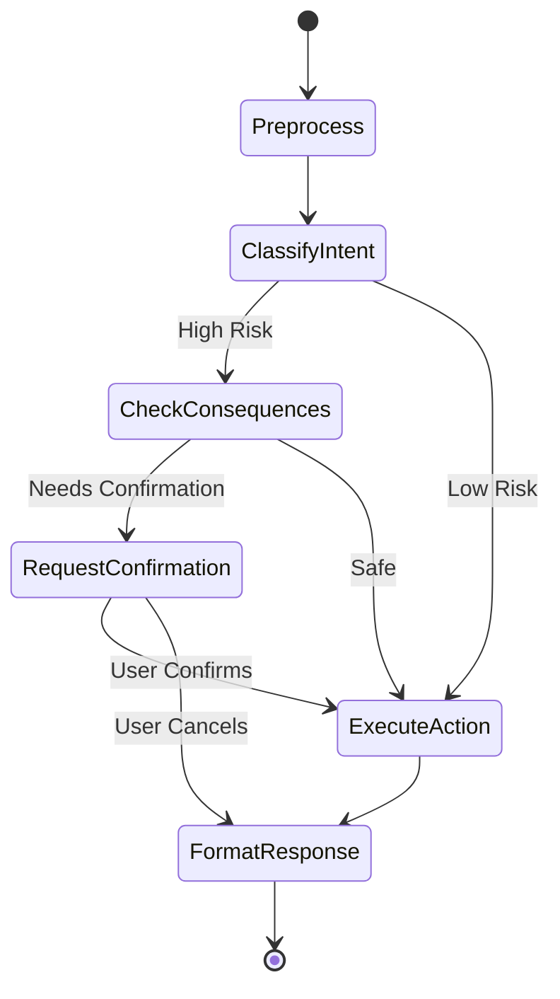

# REVISED JIRA TICKETS #8-#12: Gradio UI Implementation

---

## **TICKET #8: Gradio UI - Dashboard & ManageRoute Tabs with Data Display**
**Type:** Story  
**Priority:** Highest  
**Story Points:** 2 (1 hour) - **Reduced from 3 hours due to Gradio efficiency**  
**Status:** 🔄 READY TO START

### Description
Build Gradio web interface with 2 tabs (busDashboard, manageRoute) displaying real-time data from backend APIs. Functional layout with native Gradio components matching assignment requirements.

### Acceptance Criteria
- [ ] Gradio app initialized with `gr.Blocks()` theme
- [ ] Two-tab layout implemented:
  - **Tab 1: "Bus Dashboard"** (busDashboard context)
  - **Tab 2: "Manage Routes"** (manageRoute context)
- [ ] Dashboard tab components:
  - [ ] `gr.DataFrame` - Trip list (left panel equivalent)
    - Columns: Trip Name, Booking %, Live Status
    - Data fetched from `GET /api/v1/trips`
    - Auto-refresh every 30 seconds (optional)
  - [ ] `gr.Plot` or `gr.HTML` - Map placeholder (right panel)
    - Static image or simple folium map
    - Shows stop locations from `GET /api/v1/stops`
  - [ ] Movi chat interface placeholder (implemented in TICKET #9)
- [ ] ManageRoute tab components:
  - [ ] `gr.DataFrame` - Route table
    - Columns: Route ID, Route Name, Direction, Shift Time, Start Point, End Point, Capacity, Status, Actions
    - Data fetched from `GET /api/v1/routes`
    - Sortable and filterable
  - [ ] `gr.Button` - "Create Route" (triggers input form)
  - [ ] Movi chat interface placeholder (implemented in TICKET #9)
- [ ] Backend API integration:
  - [ ] Async HTTP client (httpx) for API calls
  - [ ] Error handling for failed API requests
  - [ ] Loading states during data fetch
- [ ] Basic styling:
  - [ ] Gradio theme customization (optional: `gr.themes.Soft()`)
  - [ ] Consistent layout with padding/spacing
  - [ ] Tab icons (🚌 for Dashboard, 🛣️ for Routes)
- [ ] Page context tracking:
  - [ ] Gradio state variable: `current_page` ("busDashboard" | "manageRoute")
  - [ ] Passed to chat interface for context-aware responses

### Implementation Strategy
**File Structure:**
```
frontend/
├── gradio_app.py           # Main Gradio app entry point
├── requirements.txt        # Gradio dependencies
├── components/
│   ├── __init__.py
│   ├── dashboard.py        # Dashboard tab components
│   ├── routes.py          # ManageRoute tab components
│   └── data_fetcher.py    # API integration utilities
└── assets/
    └── map_placeholder.png # Optional map image
```

**Core Components:**
1. **Data Fetcher (`components/data_fetcher.py`)**
   ```python
   # Async functions to fetch from FastAPI backend
   async def fetch_trips() -> pd.DataFrame
   async def fetch_routes() -> pd.DataFrame
   async def fetch_stops() -> List[Dict]
   ```

2. **Dashboard Tab (`components/dashboard.py`)**
   ```python
   def create_dashboard_tab() -> gr.Tab:
       # Returns gr.Tab with DataFrames and Map
   ```

3. **Routes Tab (`components/routes.py`)**
   ```python
   def create_routes_tab() -> gr.Tab:
       # Returns gr.Tab with Route table
   ```

4. **Main App (`gradio_app.py`)**
   ```python
   with gr.Blocks(theme=gr.themes.Soft()) as app:
       with gr.Tab("🚌 Bus Dashboard"):
           dashboard_components = create_dashboard_tab()
       with gr.Tab("🛣️ Manage Routes"):
           route_components = create_routes_tab()
   
   app.launch(server_name="0.0.0.0", server_port=7860)
   ```

### Technical Notes
**Gradio Features to Use:**
- `gr.Blocks()` - Custom layout container
- `gr.Tab()` - Tab navigation
- `gr.DataFrame()` - Data tables with sorting/filtering
- `gr.Plot()` or `gr.HTML()` - Map visualization
- `gr.State()` - Track current page context
- `gr.Button()` - Action triggers

**Data Fetching:**
- Use `httpx.AsyncClient()` for non-blocking API calls
- Backend API: `http://localhost:8000/api/v1/`
- Handle network errors gracefully (show error message in UI)

**Map Options (Choose One):**
1. **Static Image**: Placeholder map image (fastest)
2. **Folium Map**: Interactive map with stop markers (if time permits)
3. **HTML Embed**: Simple Leaflet.js map

**Refresh Strategy:**
- Manual refresh button for each tab
- Optional: Auto-refresh every 30s using `gr.Timer()` (Gradio 4.0+)

**Dependencies:**
```txt
gradio>=4.0.0
httpx>=0.27.0
pandas>=2.0.0
folium>=0.15.0  # Optional for map
```

### Testing Checklist
- [ ] Both tabs render without errors
- [ ] Trip data displays correctly (8 trips including "Bulk - 00:01")
- [ ] Route data displays correctly (12 routes)
- [ ] Tab switching works smoothly
- [ ] current_page state updates on tab change
- [ ] API errors show user-friendly messages
- [ ] Layout is readable on desktop screen

### Dependencies
✅ TICKET #7 (needs API endpoints `/api/v1/trips`, `/api/v1/routes`, `/api/v1/stops`)

---

## **TICKET #9: Gradio Chat Interface with Multimodal Input & TTS Output**
**Type:** Story  
**Priority:** Highest  
**Story Points:** 3 (1.5 hours) - **Reduced from React complexity**  
**Status:** 🔄 READY TO START

### Description
Build Movi chat interface integrated into both Gradio tabs with text, voice, image, and video input support. Implement mandatory TTS (Text-to-Speech) output for agent responses using OpenAI API.

### Acceptance Criteria

#### **Core Chat Interface:**
- [ ] Chat interface present on BOTH tabs (Dashboard + ManageRoute)
- [ ] `gr.Chatbot()` - Message history display (user + assistant)
- [ ] `gr.Textbox()` - Text input with submit button
- [ ] `gr.Button()` - Send message
- [ ] Loading indicator during agent processing (`gr.Status()`)
- [ ] Auto-scroll to latest message (native Gradio behavior)
- [ ] Session persistence using Gradio `gr.State()`

#### **Multimodal Input (MANDATORY):**
- [ ] **Text Input**: Native `gr.Textbox()`
- [ ] **Voice Input**: `gr.Audio(sources=["microphone"], type="filepath")`
  - Records audio from browser microphone
  - Sends to backend as base64 for Gemini STT
- [ ] **Image Upload**: `gr.Image(type="filepath")`
  - Accepts: JPEG, PNG, WebP, GIF
  - Use case: Upload dashboard screenshot → "Remove vehicle from this trip"
  - Sends to Gemini for visual understanding
- [ ] **Video Upload**: `gr.Video()`
  - Accepts: MP4, WebM, MOV
  - Sends to Gemini for temporal analysis
- [ ] **File Upload Button**: `gr.File(file_types=["image", "audio", "video"])`
  - Alternative unified upload interface
- [ ] Multimodal data encoding:
  - Convert files to base64 before sending to backend
  - Include media_type in request: "audio", "image", "video"

#### **TTS Output (MANDATORY - Per Assignment):**
- [ ] **Backend TTS Implementation** (`app/utils/tts.py`):
  - [ ] OpenAI TTS API integration
  - [ ] Model: `gpt-4o-audio-preview` or `tts-1`
  - [ ] Voice: "coral" (warm, helpful, professional)
  - [ ] Format: MP3 (smaller file size) or WAV (better quality)
  - [ ] API Endpoint: `POST /api/v1/agent/tts`
    - Request: `{"text": "Agent response here"}`
    - Response: Audio file (bytes) or URL
- [ ] **Frontend TTS Integration**:
  - [ ] `gr.Audio()` component for playback (auto-play enabled)
  - [ ] Agent responses automatically played as audio
  - [ ] Toggle button: `gr.Checkbox("Enable Voice Output", value=True)`
  - [ ] When enabled: Auto-play TTS audio after agent response
  - [ ] When disabled: Show text-only response
  - [ ] Optional: Volume control slider `gr.Slider(0, 100, value=80)`
- [ ] TTS caching (optional):
  - Cache generated audio to avoid re-generating same responses
  - Store in `/tmp/tts_cache/` or similar

#### **Confirmation Dialog (High-Risk Actions):**
- [ ] Conditional UI rendering based on `requires_confirmation` flag
- [ ] When confirmation needed:
  - [ ] Show warning message in chat (yellow/orange background)
  - [ ] Display consequence explanation from agent
  - [ ] Render 3 action buttons:
    - `gr.Button("✅ Yes, Proceed", variant="primary")`
    - `gr.Button("❌ No, Cancel", variant="secondary")`
    - `gr.Button("✏️ Modify Action", variant="secondary")`
- [ ] Button actions:
  - **Yes**: Call `POST /api/v1/agent/confirm` with `user_confirmed=True`
  - **No**: Call `POST /api/v1/agent/confirm` with `user_confirmed=False`
  - **Modify**: Allow user to type new instruction, restart intent classification
- [ ] Hide buttons after user selection
- [ ] Show confirmation choice in chat history

#### **Context-Aware Integration:**
- [ ] Chat interface knows which tab user is on
- [ ] Pass `current_page` context to backend:
  - Dashboard tab → `"busDashboard"`
  - ManageRoute tab → `"manageRoute"`
- [ ] Backend uses context for:
  - Intent classification (e.g., "create a route" on Dashboard → warns about wrong page)
  - Tool suggestions
  - Response formatting

#### **Error Handling:**
- [ ] Network errors: "Unable to reach Movi. Please try again."
- [ ] Agent errors: Display error message from backend
- [ ] TTS errors: Fallback to text-only (don't break chat)
- [ ] Multimodal errors: "Unable to process [image/audio/video]. Please try again."
- [ ] Timeout handling: 30s timeout for agent responses

### Implementation Strategy

**File Structure:**
```
frontend/
├── gradio_app.py
├── components/
│   ├── chat_interface.py    # Main chat component
│   ├── multimodal_inputs.py # Audio/Image/Video inputs
│   ├── confirmation.py      # Confirmation dialog logic
│   └── tts_handler.py       # TTS playback logic
└── utils/
    ├── api_client.py        # Backend API calls
    └── file_encoder.py      # Base64 encoding for media

backend/
├── app/
│   ├── utils/
│   │   └── tts.py           # OpenAI TTS integration
│   └── api/v1/
│       └── agent.py         # Add TTS endpoint
```

**Core Functions:**

1. **Chat Handler (`components/chat_interface.py`)**
   ```python
   async def handle_message(
       user_input: str,
       audio: Optional[str],
       image: Optional[str],
       video: Optional[str],
       current_page: str,
       session_id: str,
       history: List[Tuple[str, str]]
   ) -> Tuple[List[Tuple[str, str]], str]:
       """
       Process user message with multimodal inputs.
       Returns: (updated_history, audio_url_for_tts)
       """
   ```

2. **Confirmation Handler (`components/confirmation.py`)**
   ```python
   async def handle_confirmation(
       action: str,  # "yes" | "no" | "modify"
       session_id: str,
       modify_text: Optional[str] = None
   ) -> Dict[str, Any]:
       """Handle user confirmation response."""
   ```

3. **TTS Handler (`components/tts_handler.py`)**
   ```python
   async def play_tts(text: str, tts_enabled: bool) -> Optional[str]:
       """
       Generate and return TTS audio URL.
       Returns None if TTS disabled.
       """
   ```

4. **Backend TTS Endpoint (`app/api/v1/agent.py`)**
   ```python
   @router.post("/tts")
   async def generate_tts(request: TTSRequest) -> StreamingResponse:
       """
       Generate TTS audio from text using OpenAI.
       Returns audio/mp3 stream.
       """
   ```

**Gradio Layout:**
```python
with gr.Tab("🚌 Bus Dashboard"):
    # ... existing dashboard components ...
    
    with gr.Column():
        gr.Markdown("### 💬 Movi Assistant")
        chatbot = gr.Chatbot(height=400, label="Chat with Movi")
        
        with gr.Row():
            msg = gr.Textbox(
                placeholder="Ask Movi anything...",
                show_label=False,
                scale=4
            )
            send_btn = gr.Button("Send", scale=1)
        
        with gr.Accordion("🎤 Multimodal Inputs", open=False):
            audio_input = gr.Audio(sources=["microphone"], type="filepath")
            image_input = gr.Image(type="filepath")
            video_input = gr.Video()
        
        tts_enabled = gr.Checkbox("🔊 Enable Voice Output", value=True)
        tts_audio = gr.Audio(visible=False, autoplay=True)
        
        # Confirmation buttons (hidden by default)
        with gr.Row(visible=False) as confirmation_row:
            confirm_yes = gr.Button("✅ Yes, Proceed", variant="primary")
            confirm_no = gr.Button("❌ No, Cancel", variant="secondary")
            confirm_modify = gr.Button("✏️ Modify Action", variant="secondary")
```

### Technical Notes

**OpenAI TTS API:**
```python
# Backend implementation (app/utils/tts.py)
import openai

async def generate_speech(text: str, voice: str = "coral") -> bytes:
    """
    Generate speech from text using OpenAI TTS.
    
    Args:
        text: Text to convert to speech
        voice: OpenAI voice (alloy, echo, fable, onyx, nova, shimmer, coral)
    
    Returns:
        Audio bytes (MP3 format)
    """
    response = await openai.audio.speech.create(
        model="tts-1",  # or "tts-1-hd" for higher quality
        voice=voice,
        input=text,
        response_format="mp3"
    )
    return response.content
```

**Environment Variables:**
```bash
# Add to backend/.env
OPENAI_API_KEY=your_openai_api_key_here
TTS_VOICE=coral
TTS_MODEL=tts-1
TTS_ENABLED=true
```

**Multimodal Encoding:**
```python
# utils/file_encoder.py
import base64

def encode_file_to_base64(filepath: str) -> str:
    """Convert file to base64 string for API transmission."""
    with open(filepath, "rb") as f:
        return base64.b64encode(f.read()).decode("utf-8")
```

**Session State Management:**
```python
# Use Gradio State to persist:
session_state = gr.State({
    "session_id": str(uuid.uuid4()),
    "current_page": "busDashboard",
    "pending_confirmation": False,
    "history": []
})
```

### Testing Checklist
- [ ] Text messages work in both tabs
- [ ] Audio recording works (microphone permission granted)
- [ ] Image upload triggers Gemini vision analysis
- [ ] Video upload processed correctly
- [ ] TTS plays automatically after agent response
- [ ] TTS toggle works (enable/disable voice)
- [ ] Confirmation dialog appears for high-risk actions
- [ ] All 3 confirmation buttons work (Yes/No/Modify)
- [ ] Context switching between tabs updates current_page
- [ ] Error messages display gracefully
- [ ] Session persists across multiple messages

### Dependencies
✅ TICKET #7 (needs `/api/v1/agent/message`, `/api/v1/agent/confirm`)  
✅ TICKET #8 (needs Gradio tab structure)  
**NEW:** OpenAI API account with TTS access

---

## **TICKET #10: Consequence Checking UI Integration & Confirmation Flow**
**Type:** Story  
**Priority:** Highest  
**Story Points:** 1 (30 minutes) - **Reduced due to backend completeness**  
**Status:** 🔄 READY TO START

### Description
Integrate consequence checking logic (already implemented in backend) with Gradio UI to display warnings and handle user confirmations for high-risk actions.

### Acceptance Criteria

#### **Backend Verification (Already Complete from TICKET #3):**
- [x] `get_consequences_for_action` tool fully implemented
- [x] Checks booking_percentage > 0%
- [x] Checks if deployment exists
- [x] Checks if route is active/deactivated
- [x] Returns risk_level ("none" | "low" | "high")
- [x] Returns detailed explanation with affected employee count

#### **UI Integration (NEW Work):**
- [ ] When agent returns `requires_confirmation: true`:
  - [ ] Display warning message with visual styling:
    - Yellow/orange background for high risk
    - Warning icon (⚠️) prefix
    - Bold consequence text
  - [ ] Show consequence details from backend:
    - "This trip is 25% booked"
    - "Removing vehicle will cancel bookings"
    - "Trip-sheet generation will fail"
    - "This affects 8 employees"
  - [ ] Render confirmation buttons (from TICKET #9)
- [ ] Message formatting in chat:
  ```
  ⚠️ WARNING: High-Risk Action
  
  You are about to remove vehicle from "Bulk - 00:01".
  
  Consequences:
  • Trip is currently 25% booked
  • This will cancel bookings for 8 employees
  • Trip-sheet generation will fail
  • Affected employees will need rebooking
  
  Do you want to proceed?
  [✅ Yes, Proceed] [❌ No, Cancel] [✏️ Modify Action]
  ```

#### **Confirmation Flow Testing:**
- [ ] **Scenario 1: User confirms (Yes)**
  - User clicks "✅ Yes, Proceed"
  - Frontend calls `POST /api/v1/agent/confirm` with `user_confirmed: true`
  - Backend executes `remove_vehicle_from_trip` tool
  - Agent responds: "Vehicle removed. 8 bookings cancelled. Please contact affected employees."
  - Success message displayed in chat
  
- [ ] **Scenario 2: User cancels (No)**
  - User clicks "❌ No, Cancel"
  - Frontend calls `POST /api/v1/agent/confirm` with `user_confirmed: false`
  - Backend skips tool execution
  - Agent responds: "Action cancelled. Vehicle remains assigned to trip."
  - Cancellation message displayed in chat
  
- [ ] **Scenario 3: User modifies (Modify)**
  - User clicks "✏️ Modify Action"
  - Text input appears: "What would you like to do instead?"
  - User types: "Reassign vehicle MH-12-3456 to Path Path - 00:02 instead"
  - Frontend sends new message to agent
  - Agent re-classifies intent and processes new request

#### **Edge Cases:**
- [ ] **Read-only consequence queries** don't trigger confirmation:
  - User: "What would happen if I remove vehicle from Bulk - 00:01?"
  - Agent: Returns consequence details WITHOUT asking for confirmation
  - No action buttons displayed
  
- [ ] **Low-risk actions** execute without confirmation:
  - Example: Creating new stop (no consequences)
  - Example: Listing routes (read-only)
  - Agent executes immediately, no confirmation needed

- [ ] **Multiple confirmations** in same session:
  - Each high-risk action triggers new confirmation
  - Previous confirmation state cleared after handling
  - No interference between separate actions

### Implementation Strategy

**UI Component Updates (`components/confirmation.py`):**
```python
def render_consequence_warning(consequence_data: Dict) -> str:
    """
    Format consequence data into user-friendly warning message.
    
    Args:
        consequence_data: {
            "risk_level": "high",
            "explanation": "Trip is 25% booked...",
            "affected_bookings": 8,
            "consequences": ["Cancel bookings", "Break trip-sheet"]
        }
    
    Returns:
        Formatted markdown string for Gradio chat
    """
```

**State Management:**
```python
# Track pending confirmation in Gradio State
confirmation_state = {
    "pending": False,
    "action": None,  # "remove_vehicle_from_trip"
    "entity_id": None,  # trip_id or other identifier
    "risk_level": None,  # "high" | "low" | "none"
    "message": None  # Consequence explanation
}
```

**API Integration:**
```python
async def handle_confirmation_response(
    action: str,  # "yes" | "no" | "modify"
    session_id: str,
    modify_text: Optional[str] = None
) -> Dict[str, Any]:
    """
    Send confirmation response to backend.
    
    POST /api/v1/agent/confirm
    {
        "session_id": "abc-123",
        "user_confirmed": true/false,
        "modify_intent": "Reassign vehicle instead..."
    }
    """
```

### Testing Checklist

**Test Scenario 1: High-Risk DELETE (Booked Trip)**
```
User Input: "Remove vehicle from Bulk - 00:01"
Expected Flow:
1. Agent detects trip has 25% booking
2. Consequence checker returns risk_level: "high"
3. UI displays warning with yellow background
4. Shows affected employee count (8 employees)
5. Renders 3 confirmation buttons
6. User clicks "Yes, Proceed"
7. Vehicle removed, bookings cancelled
8. Success message: "Vehicle removed. Please contact 8 affected employees."
```

**Test Scenario 2: Low-Risk CREATE (New Stop)**
```
User Input: "Create stop called 'Odeon Circle' at 12.9716, 77.5946"
Expected Flow:
1. Agent classifies as "create_stop"
2. Consequence checker returns risk_level: "none"
3. Tool executes immediately (no confirmation)
4. Success message: "Stop 'Odeon Circle' created successfully."
```

**Test Scenario 3: Read-Only Consequence Query**
```
User Input: "What would happen if I delete vehicle from Bulk - 00:01?"
Expected Flow:
1. Agent detects query intent (not execution)
2. Consequence checker runs in read-only mode
3. Returns consequence details
4. UI displays consequences as information (blue background, no buttons)
5. Message: "If you remove the vehicle, it would cancel 8 bookings..."
```

**Test Scenario 4: Modification Flow**
```
User Input: "Remove vehicle from Bulk - 00:01"
Agent: [Shows high-risk warning]
User: [Clicks "Modify Action"]
User Input: "Actually, reassign it to Path Path - 00:10 instead"
Expected Flow:
1. Confirmation state cleared
2. New message sent to agent
3. Agent classifies as "assign_vehicle_to_trip"
4. Different tool executed (reassignment instead of removal)
5. Success message: "Vehicle reassigned to Path Path - 00:10"
```

### Technical Notes

**Consequence Data Structure (from Backend):**
```python
{
    "risk_level": "high" | "low" | "none",
    "requires_confirmation": bool,
    "consequences": [
        "Trip is currently 25% booked",
        "Will cancel bookings for 8 employees",
        "Trip-sheet generation will fail"
    ],
    "explanation": "Detailed explanation...",
    "affected_count": 8,
    "proceed_with_caution": true
}
```

**Visual Styling (Gradio Markdown):**
```markdown
### ⚠️ WARNING: High-Risk Action

You are about to **remove vehicle from "Bulk - 00:01"**.

**Consequences:**
- 🚨 Trip is currently 25% booked
- 👥 This will cancel bookings for 8 employees  
- 📋 Trip-sheet generation will fail
- 📞 Affected employees will need rebooking

Do you want to proceed?
```

**Error Handling:**
- If consequence check fails (DB error): Allow execution with warning
- If confirmation request times out: Reset confirmation state
- If API call fails: Show error, allow retry

### Dependencies
✅ TICKET #3 (consequence tools complete)  
✅ TICKET #5 (LangGraph consequence flow complete)  
✅ TICKET #7 (confirmation API endpoint complete)  
✅ TICKET #9 (chat interface with confirmation buttons)

---

## **TICKET #11: End-to-End Integration & Testing**
**Type:** Task  
**Priority:** High  
**Story Points:** 2 (1 hour) - **Unchanged**  
**Status:** 🔄 READY TO START

### Description
Comprehensive integration testing of full system: Gradio UI → Multimodal Input → LangGraph Agent → Tools → Database → Response → UI Update. Verify all critical workflows.

### Acceptance Criteria

#### **Test Scenarios (7 Required):**

**1. Simple Read Query (Text Only)**
- [ ] **Input**: "How many unassigned vehicles?"
- [ ] **Expected**:
  - Agent classifies intent: `get_unassigned_vehicles_count`
  - Tool executes without consequence check
  - Response: "There are 3 unassigned vehicles available"
  - TTS audio plays response
  - No confirmation dialog
- [ ] **Verify**: Tool execution in logs, correct count, <3s response time

**2. Multimodal: Image Upload with Consequence Flow**
- [ ] **Input**: Upload screenshot of dashboard + text "Remove vehicle from this trip"
- [ ] **Expected**:
  - Gemini extracts trip name from image ("Bulk - 00:01")
  - Agent classifies intent: `remove_vehicle_from_trip`
  - Consequence checker detects 25% booking
  - Warning displayed with affected employee count
  - Confirmation buttons rendered
- [ ] **Verify**: Image processed correctly, trip identified, consequence check triggered

**3. High-Risk Action with User Confirmation (Full Flow)**
- [ ] **Input**: "Delete vehicle from Bulk - 00:01"
- [ ] **Step 1**: Warning message displays
- [ ] **Step 2**: User clicks "✅ Yes, Proceed"
- [ ] **Step 3**: Tool executes `remove_vehicle_from_trip`
- [ ] **Step 4**: Success message with booking cancellation notice
- [ ] **Verify**: 
  - Database updated (deployment removed)
  - Trip booking_percentage remains but vehicle unassigned
  - Session state persisted through confirmation

**4. Modification Flow (Change Intent Mid-Confirmation)**
- [ ] **Input**: "Remove vehicle from Bulk - 00:01"
- [ ] **Step 1**: Warning displays
- [ ] **Step 2**: User clicks "✏️ Modify Action"
- [ ] **Step 3**: User types "Reassign it to Path Path - 00:10 instead"
- [ ] **Step 4**: Agent reclassifies to `assign_vehicle_to_trip`
- [ ] **Step 5**: New tool executes (different action)
- [ ] **Verify**: Intent changed, different tool called, no deletion occurred

**5. Context Awareness (Page-Specific Behavior)**
- [ ] **Setup**: User on "Manage Routes" tab
- [ ] **Input**: "Create a new route for Path-1 at 09:00"
- [ ] **Expected**: 
  - Agent uses `current_page: "manageRoute"` context
  - Creates route successfully
  - Response acknowledges correct page context
- [ ] **Contrast**: Same query on Dashboard tab should mention "You're on dashboard, but I can still create route"
- [ ] **Verify**: Page context passed correctly, affects agent response

**6. Error Handling (Invalid Input)**
- [ ] **Input**: "Show me trip with ID 999" (non-existent trip)
- [ ] **Expected**:
  - Tool executes `get_trip_status(trip_id=999)`
  - Returns error: "Trip not found"
  - Agent responds: "I couldn't find trip 999. Available trips are: Bulk - 00:01, Path Path - 00:02..."
  - No crash, graceful error message
- [ ] **Verify**: Error handled in tool, agent formats user-friendly message

**7. Voice Input (Audio Transcription)**
- [ ] **Input**: Record audio "List all stops for Path-2"
- [ ] **Expected**:
  - Audio sent to Gemini for transcription
  - Text extracted: "List all stops for Path-2"
  - Agent processes as normal text query
  - Response lists stops: Gavipuram, Temple, Peenya
  - TTS reads response aloud
- [ ] **Verify**: STT working, audio processed correctly, TTS plays

#### **All 10 Tools Verification:**
- [ ] Tool 1: `get_unassigned_vehicles_count` - Tested in Scenario 1
- [ ] Tool 2: `get_trip_status` - Test separately with valid trip
- [ ] Tool 3: `list_stops_for_path` - Tested in Scenario 7
- [ ] Tool 4: `list_routes_by_path` - Test with Path-1
- [ ] Tool 5: `assign_vehicle_to_trip` - Tested in Scenario 4
- [ ] Tool 6: `remove_vehicle_from_trip` - Tested in Scenarios 2 & 3
- [ ] Tool 7: `create_stop` - Test: "Create stop 'Test Stop' at 12.97, 77.64"
- [ ] Tool 8: `create_path` - Test: "Create path with stops [1,3,5]"
- [ ] Tool 9: `create_route` - Tested in Scenario 5
- [ ] Tool 10: `get_consequences_for_action` - Tested in Scenarios 2 & 3

#### **Session Persistence:**
- [ ] Multi-turn conversation:
  - Turn 1: "How many vehicles?"
  - Turn 2: "What's the status of Bulk - 00:01?"
  - Turn 3: "Remove vehicle from it" (should remember "Bulk - 00:01")
- [ ] Verify: Session ID consistent, history maintained, context preserved

#### **Performance Benchmarks:**
- [ ] Simple read query: <3 seconds
- [ ] Complex query with consequence check: <5 seconds
- [ ] Image processing: <8 seconds
- [ ] Video processing: <15 seconds
- [ ] TTS generation: <2 seconds

#### **Bug Documentation:**
- [ ] Create `BUGS.md` file documenting any issues found
- [ ] Prioritize: Critical (blocks demo) vs. Minor (cosmetic)
- [ ] For each bug:
  - Description
  - Steps to reproduce
  - Expected vs. Actual behavior
  - Severity (Critical/High/Medium/Low)
  - Fix status (Fixed/Deferred/Wontfix)

### Implementation Strategy

**Test Automation Script:**
```python
# test_e2e_gradio.py
import asyncio
from gradio_client import Client

async def run_e2e_tests():
    """Execute all 7 test scenarios programmatically."""
    client = Client("http://localhost:7860")
    
    # Test 1: Simple read
    result = client.predict(
        user_input="How many unassigned vehicles?",
        api_name="/chat"
    )
    assert "3 unassigned" in result.lower()
    
    # Test 2: Image upload
    result = client.predict(
        user_input="Remove vehicle from this trip",
        image="test_images/dashboard_screenshot.png",
        api_name="/chat"
    )
    assert "warning" in result.lower()
    assert "bulk - 00:01" in result.lower()
    
    # ... rest of tests
```

**Manual Testing Checklist:**
```
Test Execution Log:
[ ] Scenario 1: Simple Read - PASS/FAIL - Notes: ___
[ ] Scenario 2: Image Upload - PASS/FAIL - Notes: ___
[ ] Scenario 3: Confirmation Flow - PASS/FAIL - Notes: ___
[ ] Scenario 4: Modification Flow - PASS/FAIL - Notes: ___
[ ] Scenario 5: Context Awareness - PASS/FAIL - Notes: ___
[ ] Scenario 6: Error Handling - PASS/FAIL - Notes: ___
[ ] Scenario 7: Voice Input - PASS/FAIL - Notes: ___

Performance:
- Average response time: ___ seconds
- Image processing time: ___ seconds
- TTS generation time: ___ seconds

Bugs Found: ___
Critical Issues: ___
```

### Testing Environment Setup
```bash
# 1. Start backend
cd backend
source ../venv/bin/activate
python -m uvicorn main:app --reload --port 8000

# 2. Start Gradio frontend
cd frontend
python gradio_app.py

# 3. Run automated tests (optional)
python test_e2e_gradio.py

# 4. Manual testing via browser
open http://localhost:7860
```

### Technical Notes

**Logging for Debugging:**
- Enable detailed logging in backend: `LOG_LEVEL=DEBUG`
- Check agent state transitions in logs
- Verify tool calls and responses
- Monitor API request/response times

**Database State Verification:**
```bash
# Check database after test execution
sqlite3 database/transport.db

-- Verify vehicle removal
SELECT * FROM deployments WHERE trip_id = 1;

-- Verify new stop creation
SELECT * FROM stops ORDER BY stop_id DESC LIMIT 1;

-- Reset database if needed
sqlite3 database/transport.db < database/init.sql
```

**Common Issues to Watch For:**
- Session state not persisting between messages
- Confirmation buttons not hiding after click
- TTS not playing automatically
- Image upload size limits (Gradio default: 10MB)
- Timeout errors on slow API calls
- Context switching between tabs not updating current_page

### Dependencies
✅ ALL PREVIOUS TICKETS (#1-#10)

---

## **TICKET #12: Demo Video & Documentation**
**Type:** Task  
**Priority:** High  
**Story Points:** 2 (1 hour) - **Unchanged**  
**Status:** 🔄 READY TO START

### Description
Record professional demo video showcasing Movi's key features and write comprehensive README with architecture diagrams and setup instructions.

### Acceptance Criteria

#### **Demo Video (2-4 minutes):**
- [ ] **Recording setup**:
  - Screen recording tool: OBS Studio, Loom, or QuickTime
  - Audio: Clear narration (test microphone first)
  - Resolution: 1920x1080 minimum
  - Format: MP4 (H.264 codec)
  
- [ ] **Video structure** (150-180 seconds total):
  
  **Introduction (15-20 seconds):**
  - [ ] "Hi, I'm [Your Name], and this is Movi - an AI transport agent for MoveInSync"
  - [ ] "Built with LangGraph, Claude Sonnet 4.5, and Gemini 2.5 Pro"
  - [ ] Show title screen with GitHub repo link
  
  **UI Overview (20 seconds):**
  - [ ] Navigate to Gradio interface
  - [ ] Show "Bus Dashboard" tab with trip list and map
  - [ ] Switch to "Manage Routes" tab with route table
  - [ ] Point out Movi chat interface present on both pages
  
  **Feature Demo 1: Simple Text Query (15 seconds):**
  - [ ] Type: "How many unassigned vehicles?"
  - [ ] Show agent response: "There are 3 unassigned vehicles"
  - [ ] Highlight: TTS audio playing automatically
  
  **Feature Demo 2: Multimodal - Image Upload (30 seconds):**
  - [ ] Upload screenshot of dashboard
  - [ ] Type: "Remove vehicle from this trip" (pointing to Bulk - 00:01)
  - [ ] Show: Gemini extracts trip name from image
  - [ ] Agent identifies "Bulk - 00:01" correctly
  
  **Feature Demo 3: ⭐ CONSEQUENCE FLOW (45 seconds - THE STAR):**
  - [ ] Agent detects 25% booking on "Bulk - 00:01"
  - [ ] **Show warning message**:
    - "⚠️ WARNING: Trip is 25% booked"
    - "This will cancel bookings for 8 employees"
    - "Trip-sheet generation will fail"
  - [ ] **Show confirmation buttons**: Yes / No / Modify
  - [ ] Click "✅ Yes, Proceed"
  - [ ] **Show execution**: Vehicle removed, bookings cancelled
  - [ ] **Emphasize**: "This tribal knowledge prevents accidental data loss"
  
  **Feature Demo 4: Context Awareness (15 seconds):**
  - [ ] On "Manage Routes" tab
  - [ ] Type: "Create a new route for Path-1 at 09:00"
  - [ ] Show: Agent acknowledges correct page context
  
  **Feature Demo 5: Quick Tool Montage (20 seconds):**
  - [ ] Fast cuts showing other tools:
    - Create stop: "Create stop 'Odeon Circle' at lat/lon"
    - List stops: "Show me stops for Path-2"
    - Assign vehicle: "Assign vehicle MH-12-3456 to trip 5"
  - [ ] Text overlay: "10 total actions available"
  
  **Architecture Highlight (15 seconds):**
  - [ ] Quick screen share of README architecture diagram
  - [ ] Narrate: "6-node LangGraph pipeline with consequence-first routing"
  - [ ] Show: State flow diagram
  
  **Closing (10 seconds):**
  - [ ] "GitHub repo: [your-username]/movi-transport-agent"
  - [ ] "Built in [X] hours as a technical prototype"
  - [ ] "Thank you for watching"

#### **README.md Documentation:**
- [ ] **Section 1: Project Overview** (100-150 words)
  - What is Movi?
  - Key features (multimodal, consequence-aware, LangGraph)
  - Tech stack summary
  
- [ ] **Section 2: Architecture** (200-300 words)
  - [ ] **Mermaid diagram**: LangGraph nodes and edges
    ```mermaid
    graph TD
        A[User Input] --> B[Preprocess: Gemini 2.5]
        B --> C[Classify Intent: Claude Sonnet 4.5]
        C -->|High Risk| D[Check Consequences]
        C -->|Low Risk| E[Execute Action]
        D -->|Requires Confirmation| F[Request Confirmation]
        D -->|Safe| E
        F -->|User Confirms| E
        F -->|User Cancels| G[Format Response]
        E --> G
        G --> H[End]
    ```
  - [ ] Explanation of each node's purpose
  - [ ] Description of conditional routing logic
  
- [ ] **Section 3: Tech Stack**
  - Backend: FastAPI, SQLAlchemy, LangGraph, OpenRouter
  - Frontend: Gradio 4.0+
  - AI Models: Claude Sonnet 4.5 (agent), Gemini 2.5 Pro (multimodal)
  - Database: SQLite (prototype) / PostgreSQL (production)
  - TTS: OpenAI TTS API
  
- [ ] **Section 4: Setup Instructions** (Step-by-step)
  ```bash
  # 1. Clone repository
  git clone https://github.com/[username]/movi-transport-agent.git
  cd movi-transport-agent
  
  # 2. Install Python dependencies
  python3 -m venv venv
  source venv/bin/activate  # Windows: venv\Scripts\activate
  pip install -r backend/requirements.txt
  pip install -r frontend/requirements.txt
  
  # 3. Set up environment variables
  cp backend/.env.example backend/.env
  # Edit .env with your API keys:
  # - OPENROUTER_API_KEY
  # - OPENAI_API_KEY (for TTS)
  
  # 4. Initialize database
  cd database
  sqlite3 transport.db < init.sql
  cd ..
  
  # 5. Start backend server
  cd backend
  python -m uvicorn main:app --reload --port 8000
  
  # 6. Start Gradio frontend (new terminal)
  cd frontend
  python gradio_app.py
  
  # 7. Open browser
  open http://localhost:7860
  ```
  
- [ ] **Section 5: LangGraph Agent Design** (300-400 words)
  - **AgentState Schema**: 17 fields explained
  - **Node Descriptions**:
    1. Preprocess: Multimodal input handling (Gemini)
    2. Classify Intent: Action/entity extraction (Claude)
    3. Check Consequences: Database queries for risk analysis
    4. Request Confirmation: Warning message generation (Claude)
    5. Execute Action: Tool dispatch from TOOL_REGISTRY
    6. Format Response: Natural language output (Claude)
  - **Conditional Edges**:
    - Route after classification (risk-based)
    - Route after consequences (confirmation-based)
    - Route after confirmation (user choice-based)
  - **State Persistence**: Session management strategy
  
- [ ] **Section 6: Key Features**
  - ✅ Multimodal Input (text, voice, image, video)
  - ✅ Consequence-Aware Actions (booking percentage checking)
  - ✅ User Confirmation (high-risk action blocking)
  - ✅ Context Awareness (page-specific responses)
  - ✅ Session Persistence (multi-turn conversations)
  - ✅ Text-to-Speech (OpenAI TTS)
  - ✅ 10 Transport Actions (CRUD operations)
  
- [ ] **Section 7: API Endpoints Documentation**
  ```
  Backend API (http://localhost:8000/api/v1/)
  
  GET /trips              - List all daily trips
  GET /routes             - List all routes
  GET /stops              - List all stops
  GET /vehicles/unassigned - Count unassigned vehicles
  
  POST /agent/message     - Send message to Movi
  POST /agent/confirm     - Confirm high-risk action
  GET /agent/session/{id} - Get session status
  POST /agent/tts         - Generate TTS audio
  ```
  
- [ ] **Section 8: Known Limitations & Future Enhancements**
  - **Limitations**:
    - Prototype UI (Gradio) - production would use React
    - SQLite (single-user) - production needs PostgreSQL
    - No authentication - would add JWT tokens
    - No real-time updates - would add WebSocket
  - **Future Enhancements**:
    - Multi-step action planning (compound requests)
    - Historical analytics dashboard
    - Real-time trip tracking
    - Integration with actual booking system
    - Role-based access control
  
- [ ] **Section 9: Testing**
  - How to run tests
  - Coverage summary
  - E2E test scenarios
  
- [ ] **Section 10: License & Contact**
  - License: MIT (or specify)
  - Author: [Your Name]
  - Email: [Your Email]
  - LinkedIn: [Profile Link]

#### **.env.example File:**
```bash
# Backend Configuration
DATABASE_URL=sqlite:///database/transport.db

# OpenRouter API (Gemini + Claude)
OPENROUTER_API_KEY=your_openrouter_api_key_here

# Model Configuration
GEMINI_MODEL=google/gemini-2.5-pro
CLAUDE_MODEL=anthropic/claude-sonnet-4.5

# OpenAI TTS
OPENAI_API_KEY=your_openai_api_key_here
TTS_VOICE=coral
TTS_MODEL=tts-1
TTS_ENABLED=true

# Server Configuration
DEBUG=True
LOG_LEVEL=INFO
SESSION_TTL_HOURS=24

# Frontend Configuration
FRONTEND_PORT=7860
BACKEND_URL=http://localhost:8000
```

#### **Code Comments:**
- [ ] Add docstrings to all major functions
- [ ] Inline comments for complex logic (especially in LangGraph nodes)
- [ ] Type hints for all function signatures
- [ ] README comments in configuration files

### Implementation Strategy

**Video Recording Tips:**
1. **Practice run**: Record 2-3 times, pick best take
2. **Script key phrases**: Don't improvise critical explanations
3. **Use cursor highlighting**: Make it clear what you're clicking
4. **Zoom in on important UI elements**: Confirmation dialog, warning messages
5. **Smooth transitions**: No long pauses, cut dead air
6. **Background music**: Optional, subtle (if used)

**Video Editing (Optional):**
- Trim dead space at beginning/end
- Add text overlays for key features
- Speed up long processes (e.g., image upload) to 1.5x
- Add timestamps in description for YouTube

**README Writing Process:**
1. Write architecture section first (core contribution)
2. Copy setup instructions from actual setup process
3. Screenshot architecture diagram for clarity
4. Proofread for typos (use Grammarly or similar)
5. Test setup instructions on fresh machine (if possible)

**Diagram Tools:**
- Mermaid (native GitHub support)
- Draw.io / Excalidraw (export as PNG)
- LucidChart (professional look)
- ASCII art (if time-constrained)

### Technical Notes

**Mermaid Syntax for LangGraph:**


**Video Recording Tools:**
- **Mac**: QuickTime (built-in, simple)
- **Windows**: OBS Studio (free, professional)
- **Cross-platform**: Loom (easy sharing, 5min free)
- **Screen + Webcam**: Zoom recording feature

**Video Hosting:**
- **GitHub**: Upload directly to repo (max 100MB)
- **YouTube**: Unlisted video (preferred for >100MB)
- **Vimeo**: Professional look
- **Loom**: Quick sharing with embed

### Deliverables Checklist
- [ ] Demo video file (`demo/movi_demo.mp4`)
- [ ] README.md with all sections complete
- [ ] .env.example file
- [ ] Architecture diagram(s) in `docs/diagrams/`
- [ ] Screenshots in `demo/screenshots/`
- [ ] BUGS.md (from TICKET #11 testing)
- [ ] LICENSE file (MIT recommended)
- [ ] .gitignore (exclude .env, __pycache__, etc.)

### Dependencies
✅ TICKET #11 (working system to demonstrate)

---

## **REVISED SPRINT SUMMARY**

**Total Story Points (Revised):** 10 points (5 hours estimated)

| Ticket | Original | Revised | Time Saved | Status |
|--------|----------|---------|------------|--------|
| #8 UI  | 3 pts (1.5h) | 2 pts (1h) | 0.5h | 🔄 TODO |
| #9 Chat | 3 pts (1.5h) | 3 pts (1.5h) | 0h | 🔄 TODO |
| #10 Consequences | 2 pts (1h) | 1 pt (0.5h) | 0.5h | 🔄 TODO |
| #11 Testing | 2 pts (1h) | 2 pts (1h) | 0h | 🔄 TODO |
| #12 Demo/Docs | 2 pts (1h) | 2 pts (1h) | 0h | 🔄 TODO |

**Total Time: ~5 hours (reduced from 7.5 hours with React)**

### Critical Path (Gradio):
```
✅ #1-#7 (COMPLETE) → #8 (Gradio UI) → #9 (Chat + TTS) → #10 (Consequences UI) → #11 (Testing) → #12 (Demo)
```

### Time Allocation (5-Hour Sprint):
- **Hour 1**: TICKET #8 - Gradio tabs + data tables
- **Hours 2-3**: TICKET #9 - Chat interface + multimodal + TTS
- **Hour 3.5**: TICKET #10 - Consequence UI integration
- **Hour 4**: TICKET #11 - E2E testing
- **Hour 5**: TICKET #12 - Demo video + README

### Success Criteria:
✅ Functional prototype with all 10 tools working  
✅ Multimodal input (text, audio, image) demonstrated  
✅ Consequence flow visible in demo  
✅ Professional README with architecture diagram  
✅ 2-3 minute demo video showcasing key features  

---

**You're now set to complete the prototype in 5 focused hours. Your backend foundation is solid. Let's ship this! 🚀**