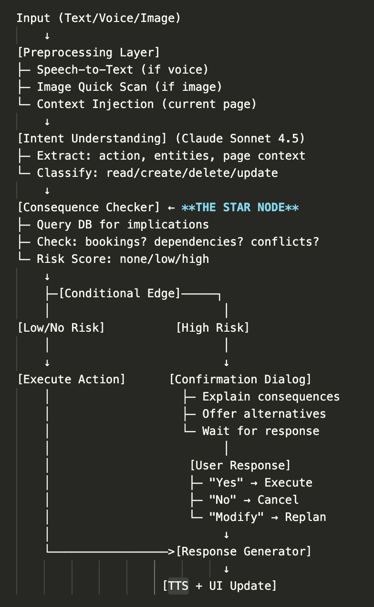

# Movi-Transport Agent

## Made by-Nachiket Kulkarni
### details- nachiram03@gmail.com, Phone.no- 9586797078

## Architecture

The system architecture is illustrated below:

### Architecture Flow (Mermaid)

> **Note**: The Mermaid diagram below renders on GitHub. To view it locally, open [`architecture.mmd`](./architecture.mmd) at [mermaid.live](https://mermaid.live) or use a Mermaid viewer.

### Architecture Overview

The Movi-Transport Agent follows a sophisticated flow:
1. **Input Layer**: Accepts text, voice, or image inputs
2. **Preprocessing Layer**: Handles speech-to-text conversion, image scanning, and context injection
3. **Intent Understanding**: Uses Claude Sonnet 4.5 to extract actions, entities, and classify operations
4. **Consequence Checker (THE STAR NODE)**: Queries database for implications, checks bookings/dependencies/conflicts, and assigns risk scores
5. **Conditional Routing**: Based on risk assessment:
   - **Low/No Risk**: Direct execution
   - **High Risk**: User confirmation dialog with alternatives
6. **Response Generator**: Generates appropriate responses with TTS and UI updates
